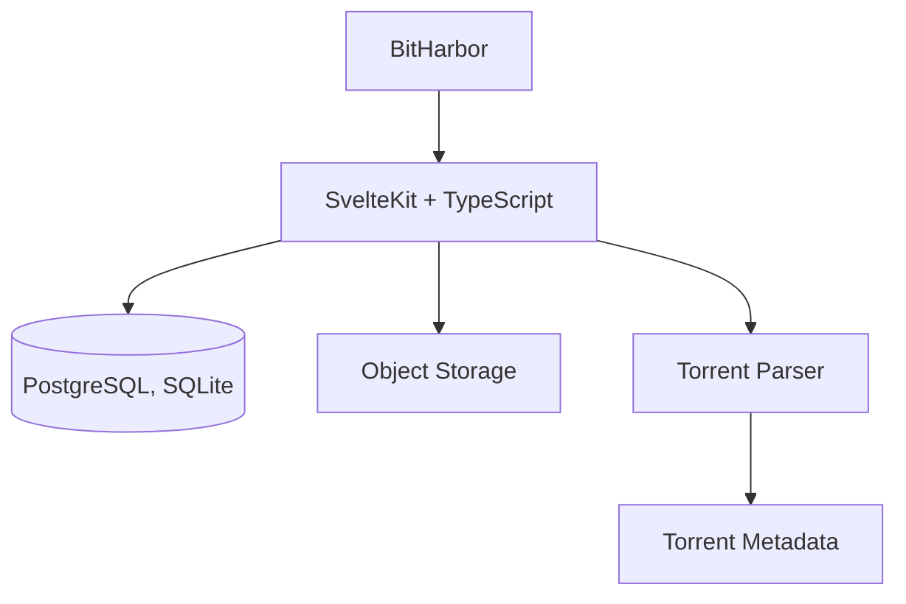

## System Overview

BitHarbor is built with SvelteKit and TypeScript. The application uses SQLite
by default or PostgreSQL when configured, object storage for files, and a
torrent parser to extract metadata from torrent files.

## Torrent Metadata

The torrent parser extracts the following information:

* Name
* Info hash
* File list
* Total size
* Trackers
* Piece information

## User Capabilities

Users can:

* Browse and search torrents
* View torrent details
* Download `.torrent` files
          * Copy magnet links
    
## Tech Stack

| Component            | Choice                                    |
| -------------------- | ----------------------------------------- |
| Full-stack framework | **SvelteKit**                             |
| Language             | **TypeScript**                            |
| Styling              | Tailwind CSS                              |
| Database             | SQLite (default) or PostgreSQL            |
| ORM                  | Drizzle ORM                               |
| `.torrent` storage   | S3-compatible object storage              |
| Torrent parsing      | Existing bencode/torrent metainfo package |
| Deployment           | Node.js + Docker                          |

## BitHarbor's Resposibility

- Torrent discovery
- Torrent metadata
- .torrent hosting
- Magnet links
- Search
- Accounts
- Upload/download
- Moderation

## Not BitHarbor's Responsibility

Tracking peers       → external trackers
Finding peers        → tracker/DHT
Downloading content  → user's torrent client
Seeding              → user's torrent client